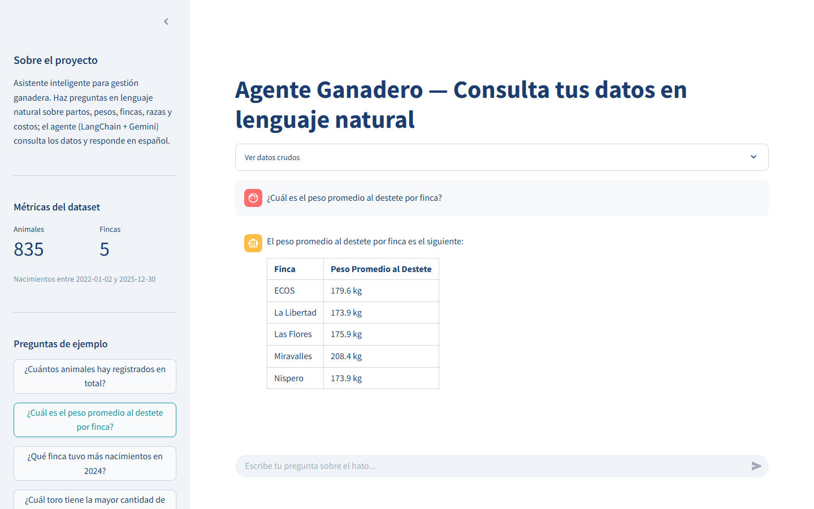
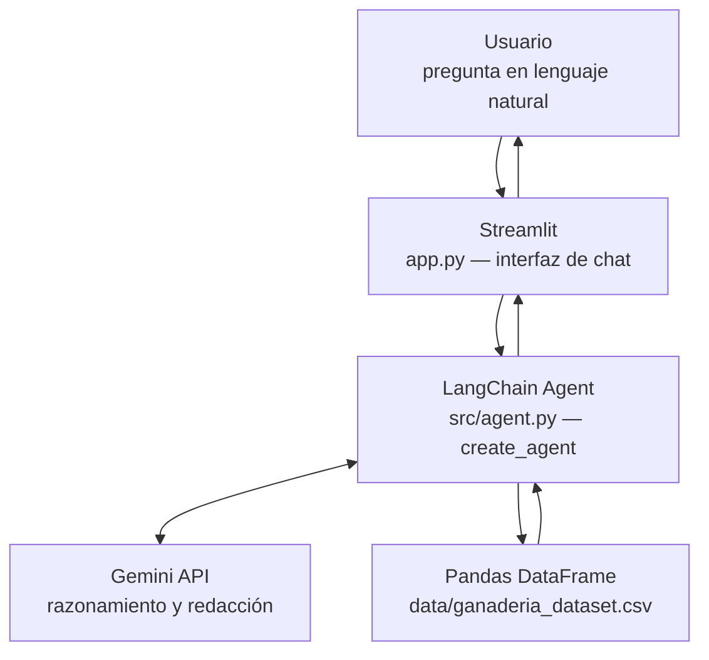

# Agente Ganadero — Alura Agente Challenge

Asistente inteligente que responde preguntas sobre datos de gestión ganadera en
lenguaje natural, construido con LangChain + Google Gemini y desplegado en una
VM de Oracle Cloud.

## Descripción general

En una finca ganadera se registran cientos de datos por animal: nacimientos,
pesos, destetes, razas, cambios de estado y costos de alimentación. Esa
información suele terminar en hojas de cálculo que solo puede interpretar quien
sabe filtrar, agrupar y cruzar columnas. Un administrador que quiere saber algo
tan simple como *"¿en cuál finca están pesando mejor mis terneros al destete?"*
depende de que alguien más le arme el reporte.

Este proyecto elimina ese intermediario. El agente recibe la pregunta escrita
como se le hablaría a una persona, decide qué cálculo hay que hacer sobre los
datos, ejecuta ese cálculo en pandas y responde en español, con unidades y
formato legible.

Concretamente, el agente:

- Interpreta preguntas en lenguaje natural sobre el hato ganadero.
- Traduce la intención a código pandas y lo ejecuta sobre el dataset real.
- Responde en español, con pesos en kilogramos y montos en colones (CRC).
- Admite explícitamente cuándo no puede responder con los datos disponibles,
  en lugar de inventar cifras.

Desarrollado como entrega del challenge **Alura Agente**.

## Demo

- **Enlace público:** [http://159.54.146.186](http://159.54.146.186)
- **Captura de pantalla:**



## Arquitectura



En texto plano, el flujo es:

```
Usuario -> Streamlit -> LangChain Agent -> Gemini API
                              |
                              v
                    Pandas DataFrame (CSV)
```

### Explicación de cada capa

| Capa | Responsabilidad | Por qué se eligió |
|------|-----------------|-------------------|
| **Streamlit** | Interfaz de chat, historial de conversación, métricas del dataset y vista de datos crudos. | Permite construir una interfaz de datos completa en Python puro, sin frontend separado. Su modelo de caché (`@st.cache_resource`) evita reconstruir el agente en cada interacción. |
| **LangChain Agent** | Orquesta el ciclo razonamiento → herramienta → respuesta. Decide qué código ejecutar y cuándo tiene suficiente información para responder. | `create_agent` (LangChain 1.x sobre LangGraph) aporta el bucle de agente con *function calling* nativo, compatible con los modelos Gemini 3.x. |
| **Tool de pandas** | Ejecuta el código generado sobre el DataFrame en un *namespace* persistente y devuelve la salida al agente. | Implementada a medida (`python_repl_ast` en `src/agent.py`) en lugar de usar `langchain-experimental`, que está deprecado y no soporta las *thought signatures* que exigen los modelos Gemini 3.x. |
| **Gemini API** | Comprende la pregunta, genera el código pandas y redacta la respuesta final en español. | El tier gratuito de Google AI Studio permite ejecutar el proyecto completo sin costo. Se usa `gemini-3.1-flash-lite-preview` por ser el de mayor cuota gratuita (15 RPM / 500 RPD). |
| **Pandas + CSV** | Almacena y procesa los datos del hato. | El volumen (cientos de registros) no justifica una base de datos; el CSV mantiene el proyecto reproducible y portable. |

Una decisión de diseño relevante: el agente **no** recibe los datos completos en
el prompt. Recibe un *resumen estructural* generado por `get_dataset_summary()`
(columnas, tipos, rangos, valores de las categóricas y porcentaje de nulos) y
consulta los datos reales ejecutando código. Esto mantiene el consumo de tokens
acotado sin importar cuánto crezca el dataset.

## Tecnologías utilizadas

| Tecnología | Versión | Propósito |
|------------|---------|-----------|
| Python | 3.11+ | Lenguaje base del proyecto |
| pandas | 2.2.3 | Carga, validación y procesamiento del dataset |
| numpy | 1.26.4 | Generación del dataset sintético con semilla fija |
| LangChain | 1.3.14 | Orquestación del agente y definición de herramientas |
| langchain-google-genai | 4.2.7 | Integración con la API de Gemini |
| Google Gemini | `gemini-3.1-flash-lite-preview` | Modelo de lenguaje (razonamiento y redacción) |
| Streamlit | 1.45.1 | Interfaz web de chat |
| python-dotenv | 1.1.0 | Carga de variables de entorno desde `.env` |
| tabulate | 0.9.0 | Formato de tablas en las respuestas del agente |
| systemd | — | Gestión del servicio en la VM (arranque y reinicio automático) |
| nginx | — | Reverse proxy del puerto 8501 al puerto 80 |
| Oracle Cloud (OCI) | — | VM donde se ejecuta el deploy |

## Dataset

**Origen:** sintético, generado con `scripts/generate_dataset.py` usando pandas y
numpy con semilla fija (42), por lo que es completamente reproducible. No
contiene datos de animales ni fincas reales.

**Volumen:** 835 registros, con nacimientos entre el 2 de enero de 2022 y el 30
de diciembre de 2025.

### Columnas

| Columna | Tipo | Descripción |
|---------|------|-------------|
| `id_animal` | texto | Identificador interno incremental, formato `CR-00001` |
| `codani` | texto | Identificador SENASA de 10 dígitos, único |
| `finca` | categórica | ECOS, Nispero, Las Flores, La Libertad, Miravalles |
| `raza` | categórica | Brahman, Angus, Nelore, Simmental, Cruzado, Jersey |
| `sexo` | categórica | M (macho) o H (hembra) |
| `fecha_nacimiento` | fecha | Fecha de nacimiento del animal |
| `peso_nacimiento` | float | Peso al nacer en kg (media 32, rango 22–45) |
| `fecha_destete` | fecha | Aproximadamente 7–9 meses tras el nacimiento; nula si no hubo destete |
| `peso_destete` | float | Peso al destete en kg (media 180, rango 120–260); nulo si no hubo destete |
| `id_madre` | texto | `id_animal` de la madre; nulo en ~20% de los casos |
| `id_toro` | texto | Toro padre, de `TORO-01` a `TORO-12` |
| `estado` | categórica | Activo, Vendido, Muerto, Traslado |
| `fecha_evento` | fecha | Fecha del cambio de estado; **nula si el animal está Activo** |
| `costo_alimentacion_mensual` | float | Costo mensual en colones (CRC), entre 15 000 y 45 000 |

### Reglas de coherencia

El generador garantiza que los datos sean internamente consistentes, lo cual es
indispensable para que las respuestas del agente tengan sentido:

- Si `estado` es *Activo*, `fecha_evento` es nula; si no, es posterior al nacimiento.
- `fecha_destete` y `peso_destete` son nulos o están presentes en conjunto.
- `peso_destete` siempre es mayor que `peso_nacimiento`.
- Los animales que murieron antes del destete no tienen registro de destete.

### Variación intencional

Para que las preguntas analíticas tengan respuestas interesantes, el dataset
incorpora dos sesgos deliberados:

- **Miravalles** tiene pesos al destete consistentemente más altos (≈208 kg
  frente a ≈174–180 kg del resto).
- **2024** concentra más nacimientos que los demás años (290 frente a ~167–191).

## Instalación y ejecución local

1. **Clonar el repositorio**

   ```bash
   git clone https://github.com/<usuario>/Challenge-Alura-Agente.git
   ```

2. **Crear y activar un entorno virtual**

   ```bash
   python -m venv .venv
   ```

   ```bash
   source .venv/bin/activate
   ```

   En Windows (PowerShell) el comando de activación es
   `.venv\Scripts\Activate.ps1`.

3. **Instalar las dependencias**

   ```bash
   pip install -r requirements.txt
   ```

4. **Configurar las variables de entorno**

   ```bash
   cp .env.example .env
   ```

   Editar `.env` y colocar la API key obtenida en
   [Google AI Studio](https://aistudio.google.com/apikey):

   ```
   GOOGLE_API_KEY=tu_api_key_aqui
   ```

5. **Generar el dataset**

   ```bash
   python scripts/generate_dataset.py
   ```

   Crea `data/ganaderia_dataset.csv` e imprime un resumen con el conteo de filas,
   el rango de fechas y el porcentaje de nulos por columna.

6. **Ejecutar la aplicación**

   ```bash
   streamlit run app.py
   ```

   La interfaz queda disponible en `http://localhost:8501`.

> **Opcional:** el notebook `notebooks/01_prototipo.ipynb` contiene una batería
> de 10 preguntas ya ejecutadas contra el agente, útil como validación previa al
> deploy.

## Ejemplos de preguntas y respuestas

Todos los pares siguientes provienen de la ejecución real del agente registrada
en `notebooks/01_prototipo.ipynb`.

**Pregunta:** ¿Cuántos animales hay registrados en total?

**Respuesta del agente:** En total, hay 835 animales registrados en el sistema.

---

**Pregunta:** ¿Cuál es el peso promedio al destete por finca?

**Respuesta del agente:** El peso promedio al destete por finca es el siguiente:

| Finca | Peso Promedio al Destete |
| :--- | :--- |
| ECOS | 179.6 kg |
| La Libertad | 173.9 kg |
| Las Flores | 175.9 kg |
| Miravalles | 208.4 kg |
| Nispero | 173.9 kg |

---

**Pregunta:** ¿Qué finca tuvo más nacimientos en 2024?

**Respuesta del agente:** La finca que tuvo más nacimientos en 2024 fue **ECOS**,
con un total de 62 nacimientos.

Aquí tienes el detalle de los nacimientos por finca en 2024:

| Finca | Nacimientos |
| :--- | :--- |
| ECOS | 62 |
| La Libertad | 60 |
| Las Flores | 59 |
| Miravalles | 56 |
| Nispero | 53 |

---

**Pregunta:** ¿Cuál es la raza más común en la finca Miravalles?

**Respuesta del agente:** La raza más común en la finca Miravalles es la
**Angus**, con un total de 32 animales registrados.

---

**Pregunta:** ¿Cuál toro tiene la mayor cantidad de crías registradas?

**Respuesta del agente:** El toro con la mayor cantidad de crías registradas es
el **TORO-09**, con un total de **81 crías**.

---

**Pregunta:** ¿Cuál es la diferencia de peso al destete entre machos y hembras?

**Respuesta del agente:** El peso promedio al destete según el sexo es el
siguiente:

* **Machos:** 182.6 kg
* **Hembras:** 181.7 kg

La diferencia de peso al destete entre machos y hembras es de **0.9 kg**, siendo
los machos ligeramente más pesados en promedio.

---

**Pregunta:** ¿Cuántos animales no tienen registro de destete?

**Respuesta del agente:** Actualmente, hay 151 animales que no tienen registro de
destete en el sistema.

---

**Pregunta:** ¿Cuál es el costo promedio de alimentación mensual en La Libertad?

**Respuesta del agente:** El costo promedio de alimentación mensual en la finca
La Libertad es de ₡28 548.3.

## Deploy en OCI

El despliegue se hace sobre una VM de Oracle Cloud (Ubuntu) siguiendo este
esquema: Streamlit corre como servicio de systemd escuchando solo en
`127.0.0.1:8501`, y nginx actúa como reverse proxy exponiendo el puerto 80 hacia
internet.

Resumen del proceso:

1. Crear la instancia en OCI y abrir el puerto 80 en la *security list*.
2. Clonar el repositorio en `/home/ubuntu/Challenge-Alura-Agente` e instalar las
   dependencias en un virtualenv.
3. Crear el archivo `.env` en la VM con la API key (no viaja en el repositorio).
4. Instalar el servicio: copiar `deploy/alura-agente.service` a
   `/etc/systemd/system/` y habilitarlo con `systemctl enable --now`.
5. Instalar el reverse proxy: copiar `deploy/nginx.conf` a
   `/etc/nginx/sites-available/`, crear el symlink en `sites-enabled/` y
   recargar nginx.

> La configuración de nginx incluye los headers `Upgrade` y `Connection` que
> Streamlit necesita para su canal WebSocket. Sin ellos la página carga en
> blanco.

**Guía detallada paso a paso:** [`deploy/DEPLOY_OCI.md`](deploy/DEPLOY_OCI.md)

## Estructura del proyecto

```
Challenge-Alura-Agente/
├── .env.example              # Plantilla de variables de entorno
├── .gitignore
├── .streamlit/
│   └── config.toml           # Tema visual y modo de barra de herramientas
├── README.md
├── requirements.txt          # Dependencias con versiones fijadas
├── app.py                    # Interfaz Streamlit (punto de entrada)
├── data/
│   └── ganaderia_dataset.csv # Dataset generado (835 registros)
├── src/
│   ├── __init__.py
│   ├── config.py             # Carga de variables de entorno
│   ├── data_loader.py        # Lectura, validación y resumen del CSV
│   ├── agent.py              # Agente LangChain + Gemini y tool de pandas
│   └── prompts.py            # System prompt y ejemplos few-shot
├── notebooks/
│   └── 01_prototipo.ipynb    # Batería de 10 preguntas ejecutada (evidencia)
├── scripts/
│   └── generate_dataset.py   # Generador del CSV sintético (semilla 42)
└── deploy/
    ├── alura-agente.service  # Unit file de systemd
    ├── nginx.conf            # Server block del reverse proxy
    └── DEPLOY_OCI.md         # Guía paso a paso del deploy
```

## Limitaciones y mejoras futuras

### Limitaciones actuales

- **Sin memoria conversacional.** Cada pregunta se procesa de forma
  independiente: el agente no entiende referencias como *"¿y en la otra finca?"*.
  El historial se muestra en pantalla, pero no se envía al modelo.
- **Dependiente de la cuota gratuita.** Con el tier gratuito de Gemini, un uso
  intensivo agota el límite diario y el agente responde con un aviso de límite
  alcanzado. Cada pregunta consume entre 2 y 4 llamadas al modelo.
- **Sin visualizaciones.** Las respuestas son texto y tablas; el agente no genera
  gráficos aunque la pregunta se preste para ello.
- **Variabilidad en las respuestas.** Al ser un modelo generativo el que redacta,
  dos ejecuciones de la misma pregunta pueden diferir en formato o en el nivel de
  detalle, incluso con `temperature=0`.
- **Ejecución de código generado.** La tool de pandas ejecuta el código que
  produce el modelo. Es aceptable en este contexto (dataset local, sin datos
  sensibles), pero no debería exponerse públicamente con datos reales sin un
  sandbox.
- **Dataset fijo.** El CSV se carga al iniciar; no hay forma de subir otro
  archivo desde la interfaz.
- **Sin HTTPS.** El deploy expone HTTP en el puerto 80.

### Mejoras futuras

- Añadir memoria conversacional para permitir preguntas de seguimiento.
- Generar gráficos automáticamente (barras, series temporales) cuando la
  pregunta lo amerite.
- Permitir cargar un CSV propio desde la interfaz, reutilizando
  `validate_dataset()` para verificar el esquema.
- Cachear respuestas de preguntas frecuentes para reducir el consumo de cuota.
- Configurar HTTPS con Let's Encrypt sobre el nginx existente.
- Ejecutar el código generado en un sandbox aislado.
- Añadir tests automatizados sobre `data_loader.py` y una batería de regresión
  para las respuestas del agente.

## Autor

**Andy** — Full Stack Developer

Proyecto desarrollado para el challenge **Alura Agente**.
